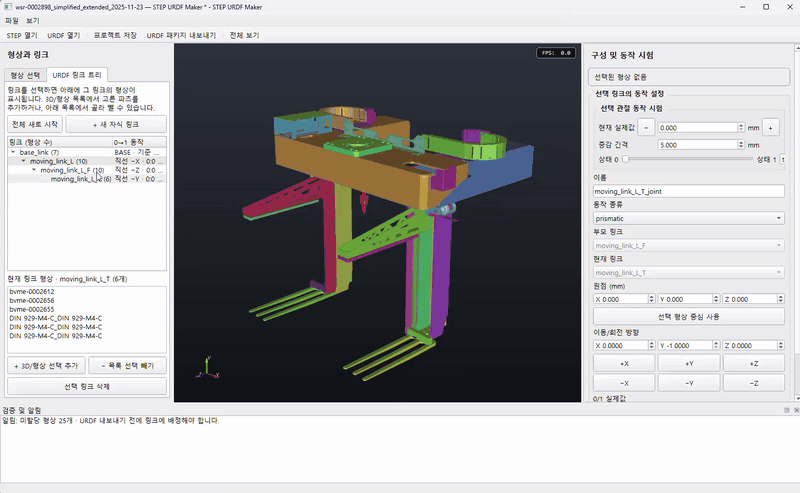
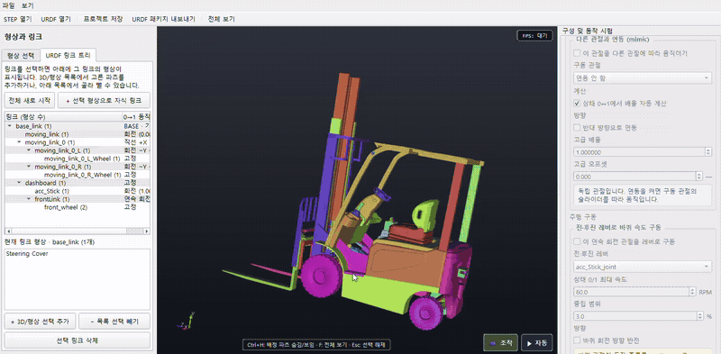

# STEP URDF Maker

<p align="center">
  <a href="./urdf.mp4">
    
  </a>
</p>

<p align="center"><strong>대표 데모가 자동 재생됩니다. 클릭하면 원본 MP4를 열 수 있습니다.</strong></p>

<p align="center">
  <a href="./urdf2.mp4">
    
  </a>
</p>

<p align="center"><strong>지게차 링크·관절·주행 연동 데모입니다. 클릭하면 원본 MP4를 재생할 수 있습니다.</strong></p>

임의의 STEP 어셈블리에 들어 있는 CAD 부품을 사용자가 기능별 URDF 링크로 직접 구성하고, 관절 위치를 즉시 시험한 뒤 ROS용 URDF 패키지로 내보내는 Windows 및 Linux 데스크톱 도구입니다. 기존 URDF와 편집 프로젝트도 다시 불러올 수 있습니다.

> 복잡한 기구를 실제로 설정하는 순서는 [케이스별 설정 매뉴얼](docs/SETTING_MANUAL.md)에서 확인할 수 있습니다. Base와 fixed 구성부터 핸들 mimic 조향, 바퀴 조향·굴림, 전·후진 레버 속도 구동까지 사례별 트리와 설정값을 계속 추가합니다.

## 주요 기능

- STEP/STP 어셈블리의 부품명, occurrence, 조립 배치를 Open Cascade XCAF로 복원
- XCAF 어셈블리 정보가 없으면 일반 STEP 솔리드 열거 방식으로 대체 로딩
- 3D 모델 또는 형상 목록에서 단일·다중 선택
- XCAF 어셈블리 경로를 그대로 보여 주는 계층형 부품 트리와 상위 어셈블리 일괄 선택
- 여러 CAD 부품을 하나의 기능 링크로 묶어 URDF 링크 수 최소화
- 링크별 형상 배정, 부모·자식 구조와 관절 종류·축·범위를 직접 설정
- 링크 트리와 관절축 표시, 슬라이더 및 `−`/`+` 버튼을 이용한 동작 미리보기
- 관절 자동 왕복 `자동 Play`와 모든 독립 가동 관절을 표시하는 `조작 Play`
- URDF 로딩 시 현재 자세와 관절 가동 범위의 실제 삼각형 메시 침투 검사
- 편집 프로젝트 저장 및 원본 STEP/URDF를 다시 읽어 구성 복원
- 기존 URDF 로딩 및 자체 메시를 포함한 ROS 2 형식 패키지 내보내기

STEP에서 읽은 형상은 프로그램 내부에서 미터 단위로 통일됩니다. 포함된 WSR STEP은 58개 배치 부품으로 복원되며, UI에서는 1 mm 메시 공차로 로딩합니다.

## Portable 배포본

GitHub Releases에서는 다음 세 종류의 압축 파일을 제공합니다.

- `windows-x64.zip`: 압축을 풀고 `STEP_URDF_Maker.exe` 실행
- `linux-x64.tar.gz`: 압축을 풀고 `./STEP_URDF_Maker.sh` 실행
- `linux-arm64.tar.gz`: ARM64 Linux에서 `./STEP_URDF_Maker.sh` 실행

Portable 배포본에는 Python과 모든 애플리케이션 라이브러리가 포함되므로 Conda나 Python을 별도로 설치할 필요가 없습니다. Linux 배포본은 Ubuntu 24.04 이상과 OpenGL을 지원하는 데스크톱 환경을 기준으로 빌드됩니다. 각 Git 태그를 푸시하면 GitHub Actions가 세 플랫폼에서 직접 빌드·테스트한 뒤 해당 태그의 Release에 압축 파일을 자동 첨부합니다.

## 소스 설치

Windows PowerShell과 `conda` 명령을 사용할 수 있는 Miniconda 또는 Anaconda가 필요합니다. 프로젝트 루트에서 다음을 실행합니다.

```powershell
conda --version
.\setup.ps1
```

`setup.ps1`은 프로젝트 안의 `.venv`에 Python 3.13, PySide6, VTK, `cadquery-ocp-novtk`와 테스트 도구를 설치합니다. OpenCascade 쪽의 중복 VTK 런타임을 제외하고, NumPy는 Windows MKL/OpenMP 지연 로딩 충돌을 피하도록 OpenBLAS를 사용합니다. `.venv`가 이미 있으면 `environment.yml`에 맞춰 업데이트합니다.

PowerShell이 로컬 스크립트 실행을 막는 경우 현재 창에서만 정책을 완화한 뒤 다시 실행할 수 있습니다.

```powershell
Set-ExecutionPolicy -Scope Process Bypass
.\setup.ps1
```

## 실행

가장 간단한 방법은 프로젝트 루트의 `STEP_URDF_Maker.bat`를 더블클릭하는 것입니다. STEP, URDF 또는 `.urdfmaker.json` 파일을 이 배치 파일 위로 끌어 놓으면 해당 파일을 바로 열어 실행합니다. 배치 실행기는 설치된 `.venv`의 `pythonw.exe`를 사용하므로 별도 콘솔창을 남기지 않습니다.

```powershell
.\run.ps1
```

실행하면서 STEP, URDF 또는 프로젝트 파일 하나를 바로 열 수도 있습니다.

```powershell
.\run.ps1 ".\data\wsr-0002898 (simplified extended) 2025-11-23.STEP"
```

파일 메뉴의 `STEP 열기…`, `URDF 열기…`, `프로젝트 열기…`를 사용하거나 지원 파일을 창에 끌어다 놓아도 됩니다. STEP 변환은 별도 프로세스에서 진행됩니다. OpenCascade 네이티브 DLL이 비정상 종료되어도 UI 전체가 함께 종료되지 않고 오류와 마지막 처리 단계가 표시됩니다. 진단 내용은 실행 파일과 같은 폴더의 `STEP_URDF_Maker.log`에 누적됩니다.

## 화면 구성과 형상 선택

- 왼쪽 `형상 선택`: STEP 부품 또는 URDF visual 목록, 현재 소속 링크, 표시 여부
- 왼쪽 `URDF 링크 트리`: 부모·자식 링크와 링크를 연결하는 관절
- 가운데 3D 화면: 카메라 조작, 부품 클릭 선택, 선택 형상 강조
- 오른쪽: 선택 관절의 원점·축·범위와 위치 시험
- 아래 `검증 및 알림`: 잘못된 트리, 누락 메시, 로딩 경고 등

3D 화면이나 형상 목록에서 클릭하면 하나를 선택합니다. 3D에서는 `Ctrl+클릭`으로 계속 추가하고 `Shift+클릭` 또는 `Alt+클릭`으로 선택에서 뺍니다. 빈 3D 배경을 클릭하거나 `Esc`를 누르면 선택이 해제됩니다. 형상 목록의 파트별 체크 상자는 `체크=보임`, `체크 해제=숨김`이며 링크 배정은 유지합니다. 목록 아래 `링크에 배정된 파츠 숨기기 (Ctrl+H)`를 체크하면 작업이 끝난 파트를 목록과 3D에서 한꺼번에 숨길 수 있습니다. `보기 → 파트 구분 색상`은 원본 재질을 바꾸지 않고 화면에서만 파츠마다 구분색을 적용합니다. `F` 또는 `전체 보기`는 보이는 모델에 카메라를 맞춥니다. 주요 단축키는 3D 화면 하단에도 표시됩니다.

링크 트리에서 링크를 선택하면 그 링크에 속한 모든 형상의 외곽선이 노란색 X-ray 형태로 표시됩니다. 다른 형상 뒤에 가려진 외곽선도 볼 수 있으며 원래 재질색은 바뀌지 않습니다. 자식 링크로 들어가는 관절은 오른쪽 편집기에 표시됩니다. 직선 이동 방향 화살표는 선택 링크 전체 형상의 현재 BBox 중심에 나타나고, 회전 관절은 실제 관절 원점을 통과하는 양방향 회전축으로 표시됩니다.

## STEP 로딩과 수동 링크 구성 원칙

STEP을 열면 모든 형상이 우선 하나의 `base_link`에 배정됩니다. 프로그램은 STEP의 CAD 제품명과 조립 배치를 복원하지만, 중립 STEP에는 모터 연결과 CAD mate/DOF가 없는 경우가 많으므로 실제 가동 관계를 확정값으로 취급하지 않습니다.

볼트, 브래킷, 판재처럼 서로 고정되어 함께 움직이는 부품은 각각 링크로 만들 필요가 없습니다. 한 번에 모두 선택해 하나의 링크에 넣으면 내보낼 때 해당 링크의 형상이 하나의 STL로 합쳐집니다.

`URDF 링크 트리`에서 `전체 새로 시작`을 누르면 빈 Base에서 수동 구성을 시작할 수 있습니다. 3D 또는 형상 목록에서 함께 움직일 파트를 고른 뒤 자식 링크를 만들고, 부모 링크와 관절 종류·축·범위를 직접 지정합니다.

## 대표 기구 마법사와 일반 편집

움직일 형상을 3D 또는 형상 목록에서 선택한 뒤 `구성 → 대표 기구 마법사…`
또는 `Ctrl+M`을 사용합니다. 다음 다섯 가지 시작 유형을 제공합니다.

- 문·뚜껑·레버: 제한 회전 `revolute`
- 슬라이더·리프트·서랍: 직선 이동 `prismatic`
- 바퀴·롤러·턴테이블: 연속 회전 `continuous`
- 그리퍼·대칭 부품: 기존 구동 관절을 따르는 표준 `mimic`
- 컨베이어 롤러·구동축: 독립 또는 입력 관절 기반 연속 회전

마법사는 링크 이름, 동작 종류, 상태 이름, 범위와 시뮬레이션 물리 시작값을
채운 뒤 기존의 `자식 링크와 동작 만들기` 창으로 이어집니다. 이 창에서 STEP
결합축 후보, BBox 주축, 관절 중심, 축 방향과 동작 범위를 그대로 정밀 조정할
수 있습니다. 마법사를 사용하지 않고 기존 `+ 선택 형상으로 자식 링크`와 오른쪽
관절 편집기로 모든 값을 직접 설정하는 방식도 유지됩니다.

마법사 관절의 effort, velocity, damping, friction은 프로젝트에 저장되고 URDF의
`<limit>`와 `<dynamics>`로 내보냅니다. 마법사 종류와 상태 이름 같은 추가 의미는
내보낸 패키지의 `config/mechanisms.json`에 함께 기록됩니다. 컨베이어의 롤러 관절은
표준 URDF로 생성되지만, 벨트 표면이 박스를 실제로 운반하는 접촉 물리는 Gazebo 등
사용할 시뮬레이터의 컨베이어 플러그인 또는 접촉 모델을 별도로 연결해야 합니다.

## 수동 듀얼 그리퍼 구성 예시

이 모델은 `base_link`에 좌·우 독립 픽커 체인을 연결하는 다음 구조로 단순화합니다.

```text
base_link
├─ left_lateral_link       좌우 이동
│  └─ left_advance_link    전진
│     └─ left_clamp_link   하강
└─ right_lateral_link      좌우 이동
   └─ right_advance_link   전진
      └─ right_clamp_link  하강
```

중요한 규칙은 바깥 이동군부터 안쪽 이동군 순으로 만드는 것입니다. 자식 단계로 옮길 형상은 현재 그 단계의 부모 링크에 속해 있어야 합니다.

| 순서 | 3D에서 선택할 형상 | 생성 링크 / 관절 | 부모 링크 | 기본 축 |
|---:|---|---|---|---|
| 1 | 왼쪽에서 좌우로 함께 이동하는 전체 뭉치. 앞쪽 기둥, 전진 뭉치, 상단 클램프 포함 | `left_lateral_link` / `left_lateral_joint` | `base_link` | `−X` |
| 2 | 1단계 형상 중 앞쪽으로 움직이는 뒤쪽 뭉치. 하강 클램프 포함 | `left_advance_link` / `left_advance_joint` | `left_lateral_link` | `+Y` |
| 3 | 2단계 형상 중 실제로 아래로 내려오는 길쭉한 상단 고정부 | `left_clamp_link` / `left_clamp_joint` | `left_advance_link` | `−Z` |
| 4 | 오른쪽에서 좌우로 함께 이동하는 전체 뭉치 | `right_lateral_link` / `right_lateral_joint` | `base_link` | `+X` |
| 5 | 4단계 형상 중 앞쪽으로 움직이는 뒤쪽 뭉치. 하강 클램프 포함 | `right_advance_link` / `right_advance_joint` | `right_lateral_link` | `+Y` |
| 6 | 5단계 형상 중 실제로 아래로 내려오는 길쭉한 상단 고정부 | `right_clamp_link` / `right_clamp_joint` | `right_advance_link` | `−Z` |

표의 순서대로 움직일 자식 형상을 먼저 선택하고 `+ 선택 형상으로 자식 링크`를 눌러 각 링크를 직접 만듭니다. 생성 창에서 링크·관절 이름, 부모 링크, `prismatic` 종류와 축을 입력합니다. 앞쪽 기둥은 좌우 이동 링크에는 포함하되 전진 링크에서는 제외하면, 뒤쪽 뭉치가 전진할 때 앞쪽 기둥의 자세와 전후 위치가 유지됩니다. 어느 축에서도 움직이지 않는 프레임과 고정부는 `base_link`에 남겨 둡니다.

기본 축은 현재 STEP 좌표계를 기준으로 한 시작값입니다. 실제 3D 모델에서 반대로 움직이면 동작 편집기의 `+X`, `−X`, `+Y`, `−Y`, `+Z`, `−Z` 버튼으로 축을 바꾸고 `동작 설정 적용`을 누르십시오. 새 직선 관절은 기본적으로 상태 0의 `0 mm`에서 상태 1의 `100 mm` 범위를 가집니다. 실제 스트로크에 맞게 두 실제값을 수정합니다.

형상을 잘못 묶은 경우 `URDF 링크 트리`에서 대상 링크를 선택합니다. 아래 `현재 링크 형상` 목록에서 파츠를 골라 `− 목록 선택 빼기`를 누르면 해당 파츠만 미할당 상태가 됩니다. 3D 화면이나 `형상 선택` 탭에서 파츠를 고른 뒤 `+ 3D/형상 선택 추가`를 누르면 현재 링크로 들어갑니다. 잘못 만든 링크는 트리에서 선택하고 `선택 링크 삭제`를 누릅니다. 삭제한 링크의 형상은 미할당 상태가 되고 하위 링크는 한 단계 위 부모 아래에 유지됩니다. Base는 삭제할 수 없으며 `전체 새로 시작`으로 초기화합니다.

## 링크 동작 설정과 0↔1 위치 시험

1. 왼쪽 `URDF 링크 트리`에서 시험할 이동 링크를 선택합니다.
2. 오른쪽 패널 상단의 `선택 관절 동작 시험`에서 정규화 슬라이더 `상태 0 ↔ 상태 1`을 움직이면 선택 링크와 모든 자식 링크가 3D 화면에서 즉시 움직입니다. `t=0.000`은 상태 0, `t=1.000`은 상태 1입니다.
3. 그 아래에서 동작 종류, 원점, 이동/회전 방향, `상태 0 실제값`과 `상태 1 실제값`을 확인합니다. 두 값은 URDF의 lower/upper 한계로 저장됩니다.
4. 움직일 자식 형상을 선택하고 `+ 선택 형상으로 자식 링크`를 누르면 부모와 자식만 확대됩니다.
5. STEP 원본이면 부모와 자식의 원통면에서 정확한 중심선을 읽습니다. 방향이 평행하고 중심선이 같은 원통을 최우선 후보로 표시하며, 지름 일치는 추천 신뢰도를 높이는 보조 조건으로만 사용합니다. 따라서 조립 CAD의 공통 Ø70 원통은 바로 잡고, 실제 끼워맞춤 때문에 부모·자식 지름이 조금 달라도 같은 중심선이면 후보로 사용할 수 있습니다.
6. 부모와 공통인 원통 중심선이 없으면 자식에만 있는 바퀴·구멍 원통축은 후보에서 제외합니다. 대신 선택 묶음의 `A BBox 가로 장축`, `B BBox 세로축`, `C BBox 두께축`을 표시하므로 랙이나 바퀴축의 좌우 직선 이동은 보통 A에서 바로 선택할 수 있습니다. 3D의 선을 직접 클릭하거나 생성 창의 A/B/C 카드로 선택할 수 있습니다.
7. 생성 창은 비모달 도구 창이므로 열린 상태에서 3D 화면을 회전·확대·이동할 수 있습니다. 노란 `PIVOT` 점은 관절 중심이고 주황색 `ROTATE` 원형 화살표는 실제 양의 회전 방향입니다. `회전 방향 반전`을 누르면 원형 화살표가 반대로 바뀝니다.
8. 자동 축이 어긋난 예외 모델은 `3D에서 축 위치·방향 직접 조정`을 켭니다. 3D 노란 선의 양 끝점을 끌면 방향이 바뀌고 선 가운데를 끌면 관절 중심이 바뀝니다. X/Y/Z 숫자 입력은 `고급: 축 벡터 직접 입력`에서 사용할 수 있으며, 작은 화면에서는 생성 창 안쪽을 스크롤할 수 있습니다.
9. `상태 0/1 실제값`이 미리보기 범위가 됩니다. 예를 들어 회전 관절에 `-180`, `180`을 입력하면 슬라이더 양 끝에서 실제 −180°와 +180°까지 회전합니다. `0 위치`를 누르면 중심·축 값은 유지한 채 자식의 미리보기 동작만 0°로 돌아가고, `자동으로 찾은 중심으로 복원`은 수동 편집 전의 후보 중심으로 되돌립니다.
10. 기존 관절의 중심을 수정할 때는 필요한 형상을 선택하고 `선택 형상 중심 사용`을 누르거나 `원점 (mm)`과 축을 직접 수정합니다. 값을 바꿨다면 `동작 설정 적용`을 누릅니다.

## 관절 연동(mimic)으로 조향 구성

핸들, 중앙 조향축, 좌·우 너클처럼 같은 Base에 붙어 있지만 함께 움직여야 하는 관절은 링크 부모·자식 관계로 억지로 연결하지 않습니다. 각 링크를 실제 장착 기준에 연결한 뒤 종속 관절의 오른쪽 `관절 연동`에서 구동 관절을 선택합니다.

1. 핸들 또는 중앙 조향축처럼 사용자가 움직일 관절을 먼저 만듭니다.
2. 좌·우 축/너클을 Base 아래의 별도 링크와 `prismatic` 또는 `revolute` 관절로 만듭니다.
3. 종속 관절을 트리에서 선택하고 `이 관절을 다른 관절에 따라 움직이기`를 켭니다.
4. `구동 관절`을 선택하고 `상태 0↔1에서 배율 자동 계산`을 사용합니다. 구동 관절의 상태 0/1과 종속 관절의 상태 0/1 실제값을 대응시키므로 사용자가 m/rad 배율을 계산할 필요가 없습니다.
5. 반대쪽 축이 반대로 움직여야 하면 `반대 방향으로 연동`을 켭니다. 구동 관절 슬라이더와 Play에서 모든 종속 관절이 함께 움직입니다.
6. 실제 스트로크를 알게 되면 종속 관절의 `상태 0/1 실제값`만 수정해 적용합니다. 자동 배율과 오프셋은 새 값으로 즉시 다시 계산됩니다.

바퀴 링크는 해당 축 또는 너클 링크의 자식으로 둡니다. 그러면 조향축의 이동을 강체로 따라가고, 바퀴가 굴러가는 `continuous` 관절만 별도로 유지할 수 있습니다. 악셀레이터나 전·후진 레버는 절대 위치 관계가 아니므로 위치 mimic 대신 아래의 속도 구동 미리보기를 사용합니다.

프로젝트 파일은 자동 상태 대응과 방향 반전 설정을 보존합니다. URDF로 내보낼 때는 계산된 선형 관계를 표준 `<mimic joint="..." multiplier="..." offset="..."/>` 태그로 기록하며, 외부 URDF의 mimic도 다시 불러올 수 있습니다.

## 전·후진 레버로 바퀴 속도 미리보기

전·후진 레버 하나로 방향과 속도를 함께 시험할 수 있습니다. 레버 관절은 `revolute` 또는 `prismatic`으로 만들고, 바퀴 관절은 `continuous`로 만듭니다.

1. 바퀴 관절을 트리에서 선택하고 오른쪽 `주행 구동`의 `이 연속 회전 관절을 레버로 구동`을 켭니다.
2. `전·후진 레버`에서 레버 관절을 선택하고 상태 0/1의 최대 RPM을 입력합니다.
3. 레버 상태 0은 최대 후진, 두 상태의 정확한 중앙은 중립, 상태 1은 최대 전진입니다. 중간 위치에서는 레버를 더 멀리 움직일수록 바퀴가 선형으로 빨라집니다.
4. 중앙에서 완전히 정지하기 쉽도록 `중립 범위`를 지정할 수 있습니다. 바퀴 축 방향이 반대라면 `바퀴 회전 방향 반전`을 사용합니다.
5. `🎮 조작`을 누릅니다. 설정용 좌우 패널 대신 3D 화면에 나타난 주행 레버 슬라이더를 움직이면 바퀴 속도와 방향이 즉시 바뀝니다. `조작 정지`는 재생 전 회전 위치로 복원합니다.

왼쪽과 오른쪽 구동 바퀴 각각에 같은 레버를 지정할 수 있습니다. 모델링한 두 바퀴의 축 부호가 서로 반대라면 한쪽에만 방향 반전을 켭니다. 이 설정은 `.urdfmaker.json` 프로젝트에 저장됩니다. 순수 URDF에는 조건부 속도 제어 표현이 없으므로 실제 로봇/시뮬레이터 구동에는 별도의 ROS 2 컨트롤러가 필요합니다.

`prismatic` 관절은 mm, `revolute`와 `continuous` 관절은 deg로 표시됩니다. 미리보기 위치는 최소·최대 범위 안으로 제한되며 자식 링크 전체가 함께 움직입니다. 이 위치는 프로젝트에는 저장되지만 URDF의 초기 위치로 내보내지지는 않습니다. URDF 자체에는 런타임 관절 상태를 저장하는 항목이 없기 때문입니다.

3D 화면 오른쪽 아래에는 두 가지 재생 모드가 있습니다.

- `▶ 자동`: 현재 카메라 시점을 유지한 채 독립 입력 관절을 lower↔upper 한계 사이에서 자동 왕복합니다. mimic 종속 관절과 속도 구동 바퀴도 계산 결과를 따라 움직입니다.
- `🎮 조작`: 설정용 좌우 패널을 숨기고 3D 화면 안에 모든 독립 가동 관절을 슬라이더로 표시합니다. mimic 종속 관절과 속도 구동 대상은 중복 표시하지 않고 각 원본 관절을 조작할 때 함께 움직입니다. mimic의 원본 관절은 `연동 입력`, 바퀴 속도 구동 원본은 `주행 레버`로 표시됩니다.

두 모드 모두 카메라를 자동으로 회전시키지 않으며, 사용자가 재생 중 직접 시점을 움직일 수 있습니다. 정지하면 재생 전 관절 위치와 일반 편집 UI가 복원되므로 재생은 프로젝트 설정을 변경하지 않습니다.

URDF/프로젝트를 불러오거나 관절 설정을 바꾸면 `검증 및 알림`에 충돌 파트 쌍이 `⚠ 충돌` 목록으로 표시됩니다. 충돌 항목은 굵은 빨간색으로 구분되며, 항목을 선택하면 해당하는 두 파트만 3D 화면에서 빨간색으로 강조됩니다. 다른 일반 알림을 선택하거나 충돌 재검사를 시작하면 강조가 해제되어 원래 화면 색상으로 복원됩니다. OBB로 빠르게 후보를 추린 뒤 원본 삼각형 메시의 폐곡면 내부 침투와 표면 교차를 다시 검증합니다. 현재 자세와 각 독립 관절의 최솟·중간·최댓값을 검사하며, 맞닿은 조립면은 제외하고 허용 오차 이상 실제로 들어간 경우만 침투 충돌로 표시합니다. 고밀도 메시는 UI를 멈추지 않도록 백그라운드에서 검사합니다.

이 검사는 현재 로딩된 visual 메시(시각 형상이 없으면 collision 메시)를 기준으로 합니다. 최종 동역학 판정은 운영용 collision 메시와 MoveIt, Gazebo 등의 물리/충돌 시뮬레이터에서 확인해야 합니다.

3D에 표시되는 주황색 양방향 선은 실제 회전축이며 관절 원점을 통과합니다. 새 링크의 후보는 STEP의 부모·자식 공통 원통 중심선을 먼저 사용하고, 그런 면이 없을 때 A/B/C 메시 주축으로 대체합니다. 자동값은 시작점이므로 생성 창의 슬라이더로 회전 중심을 확인하고 필요한 경우 3D 조절선이나 숫자로 미세 조정합니다.

`URDF 링크 트리`에서 `전체 새로 시작`을 누르면 빈 Base가 만들어지고 모든 형상은 미할당이 되며 선택도 해제됩니다. Base 형상을 다시 선택해 `선택 → 현재 링크`로 넣습니다. 그다음 움직일 파트를 선택하고 `+ 선택 형상으로 자식 링크`를 사용합니다. 생성 창의 부모 링크에는 현재 트리 선택이 기본값으로 들어가지만 Base나 다른 기존 링크로 자유롭게 변경할 수 있습니다. 축과 중심을 형상에서 계산하려면 자식 파트가 반드시 먼저 선택되어야 합니다. 생성 창에서 이름, `fixed/prismatic/revolute/continuous`, 원점, 축과 상태 0/1 실제값을 정합니다. 트리는 각 링크 옆에 동작 방향과 0→1 값을 함께 표시합니다. 링크에 넣지 않은 형상은 프로젝트에 미할당 상태로 저장되며, 모두 배정하기 전에는 URDF를 내보낼 수 없습니다.

수동 트리를 시작하면 이미 링크에 넣은 파츠는 작업을 쉽게 계속할 수 있도록 형상 목록과 3D에서 임시로 숨겨집니다. `사용한 파츠 보이기` 버튼이나 `Ctrl+H`로 전체 파츠 표시를 전환할 수 있습니다. 이 필터는 화면에만 적용되며 프로젝트의 원본 표시/숨김 상태와 URDF 형상은 변경하지 않습니다.

## 프로젝트 저장과 다시 열기

`프로젝트 저장` 또는 `Ctrl+S`는 `.urdfmaker.json` 파일을 만듭니다. 다음 항목이 저장됩니다.

- 원본 STEP/URDF 경로와 원본 종류
- 링크별 형상 배정과 루트 링크
- 관절 이름, 종류, 부모·자식, 원점, 축, 범위와 현재 미리보기 위치
- 형상 표시 여부와 로딩 메타데이터

프로젝트 파일에는 무거운 삼각형 메시가 포함되지 않습니다. 다시 열 때 원본 STEP 또는 URDF를 먼저 재로딩한 뒤 저장된 구성을 적용합니다. 따라서 원본 파일을 함께 보관해야 합니다. 원본 경로를 찾지 못하면 프로그램이 새 위치를 묻습니다. STEP 형상 ID는 XCAF occurrence 경로를 기준으로 안정적으로 만들며, 저장 시 이름·경계·메시 개수 서명도 함께 기록합니다. 원본 CAD의 부품이나 형상이 달라져 서명이 맞지 않으면 잘못된 이동 링크에 조용히 넣지 않고 `base_link`에 유지한 뒤 알림을 표시합니다.

## URDF 패키지 내보내기

링크 트리가 유효한 상태에서 `URDF 패키지 내보내기…` 또는 `Ctrl+E`를 사용합니다. 상위 폴더와 ROS 패키지 이름을 선택하면 다음 구조가 생성됩니다.

```text
<package_name>/
├─ CMakeLists.txt
├─ package.xml
├─ meshes/
│  └─ <link_name>.stl
├─ config/                    # 마법사 사용 시
│  └─ mechanisms.json
└─ urdf/
   └─ <robot_name>.urdf
```

각 링크에 배정한 여러 형상은 링크 좌표계의 바이너리 STL 하나로 합쳐집니다. URDF에는 visual과 같은 메시를 사용하는 collision이 생성되고, 메시 URI는 `package://<package_name>/meshes/...` 형식입니다. 내보낼 때 동역학 시뮬레이션용 BBox 근사 질량·관성을 선택적으로 생성할 수 있습니다. 실제 CAD 질량 특성이 아니므로 하중·제어 검증 전에는 반드시 보정해야 합니다. transmission과 `ros2_control` 설정은 아직 생성하지 않습니다.

내보내기 전에 프로그램은 루트가 하나인지, 링크가 연결되어 있는지, 자식 링크에 부모가 둘 이상인지, 관절축과 범위가 올바른지 검사합니다. 문제가 있으면 아래 `검증 및 알림`에 표시되며 수정 전에는 내보낼 수 없습니다.

## 다른 URDF 불러오기

`URDF 열기…`에서 `.urdf` 또는 `.xml` 파일을 선택할 수 있습니다. 링크·관절 트리, visual 형상, 재질 색상과 관절 원점·축·범위를 읽습니다. visual이 없는 링크는 collision 형상을 화면 표시용으로 사용합니다.

지원 메시 형식은 STL, OBJ, PLY, DAE/COLLADA이며, URDF 기본 형상인 box, cylinder, sphere도 표시합니다. 상대 경로와 `file://` 경로를 지원하고, `package://` URI는 다음 위치에서 찾습니다.

- URDF 상위 폴더 중 동일한 패키지 이름의 `package.xml`이 있는 ROS 패키지
- `ROS_PACKAGE_PATH`
- `AMENT_PREFIX_PATH` 아래의 `share/<package_name>`

`package://` 메시를 찾지 못해도 URDF 전체 로딩을 중단하지 않습니다. 해당 visual만 제외하고 아래 `검증 및 알림`에 시도한 경로가 포함된 누락 메시 경고를 표시합니다. 이 경우 URDF와 `meshes` 폴더 및 `package.xml`을 원래 패키지 구조로 함께 두거나, 올바른 ROS 환경을 설정한 뒤 다시 여십시오.

Xacro는 직접 실행하지 않습니다. 먼저 일반 URDF로 변환해야 합니다. 외부 URDF의 `mimic`은 편집 모델에 보존하지만 transmission, Gazebo 플러그인, `ros2_control` 같은 확장 태그는 다시 내보낼 때 사라질 수 있습니다.

외부 URDF의 원본 inertial 값과 별도 collision 형상도 무손실 보존 대상이 아닙니다. 다시 내보낼 때 원본 inertial 대신 선택적으로 BBox 근사 관성을 만들며 visual 메시를 collision으로 사용합니다. 이런 요소가 있는 URDF를 열면 아래 `검증 및 알림`에 경고가 표시됩니다. 따라서 다른 URDF는 구조 확인과 운동학 편집에는 사용할 수 있지만, 기존 동역학·제어 설정을 유지해야 한다면 생성된 URDF에 원본 태그를 별도로 합쳐야 합니다.

## 중요한 제약

- URDF는 링크와 관절의 **운동학 구조**를 설명할 뿐 작업 순서를 실행하지 않습니다. `좌우 위치 결정 → 뒤쪽 뭉치 전진 → 상단 클램프 하강 → 로봇 이동 → 해제` 순서는 별도의 ROS 2 컨트롤러, 상태 머신 또는 PLC에서 구현해야 합니다.
- 여러 종속 관절을 하나의 구동 관절에 선형 mimic으로 연결할 수 있습니다. 연결봉 폐루프의 비선형 관계는 별도의 기구 솔버가 필요합니다. 전·후진 레버 기반 바퀴 속도는 앱에서 미리볼 수 있지만 실제 장비의 토크 제어에는 별도의 컨트롤러가 필요합니다.
- STEP에는 모터 연결, 스트로크와 CAD mate 정보가 없을 수 있습니다. 원통면 중심선은 축 후보로 활용하지만 이동군과 범위는 직접 설정하고 슬라이더로 확인해야 합니다.
- 복잡한 폐루프 링크 기구는 URDF 트리로 직접 표현하지 않고, 실제 결과 운동을 나타내는 직선 또는 회전 관절로 단순화해야 합니다.
- 3D 위치 시험은 순운동학 미리보기입니다. 실제 삼각형 메시 침투는 검사하지만 동역학, 접촉력과 모터 토크는 계산하지 않습니다.
- 내보낸 collision은 정밀 visual 메시와 동일하므로 대규모 물리 시뮬레이션에서는 별도의 단순 collision 메시가 필요할 수 있습니다.

## 테스트

설치된 프로젝트 환경에서 전체 테스트를 실행하려면 다음 명령을 사용합니다.

```powershell
& .\.venv\python.exe -m pytest
```

## 다운로드

별도의 Python 설치 없이 압축을 풀어서 실행할 수 있는 포터블 배포본입니다.

- [Windows x64 다운로드 (.zip)](https://github.com/kraizer-ai/step-urdf-maker/releases/download/v0.1.7/step-urdf-maker-0.1.7-windows-x64.zip)
- [Linux x64 다운로드 (.tar.gz)](https://github.com/kraizer-ai/step-urdf-maker/releases/download/v0.1.7/step-urdf-maker-0.1.7-linux-x64.tar.gz)
- [Linux ARM64 다운로드 (.tar.gz)](https://github.com/kraizer-ai/step-urdf-maker/releases/download/v0.1.7/step-urdf-maker-0.1.7-linux-arm64.tar.gz)
- [모든 릴리스 보기](https://github.com/kraizer-ai/step-urdf-maker/releases)
